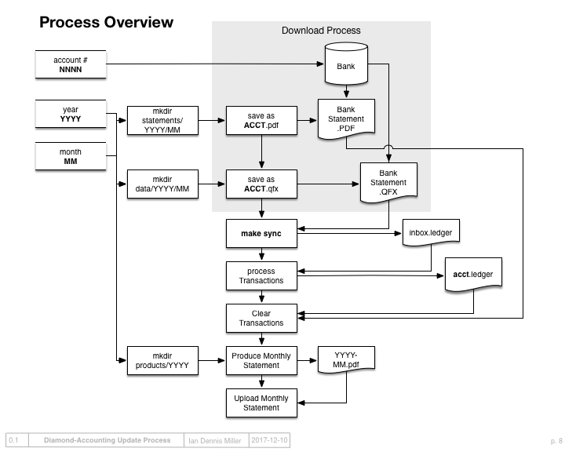

Monthly Updates
===============

.. toctree::
    :maxdepth: 1

    process/setup
    process/downloading
    process/sync
    process/categorizing
    process/clearing
    process/reporting
    process/reading

As long as account transactions can be downloaded in Quicken format, it is possible to import them into a plaintext ledger.
The purpose of updating the accounts is to download any transactions that occurred during the previous month, then import all those transactions into the ledger.

