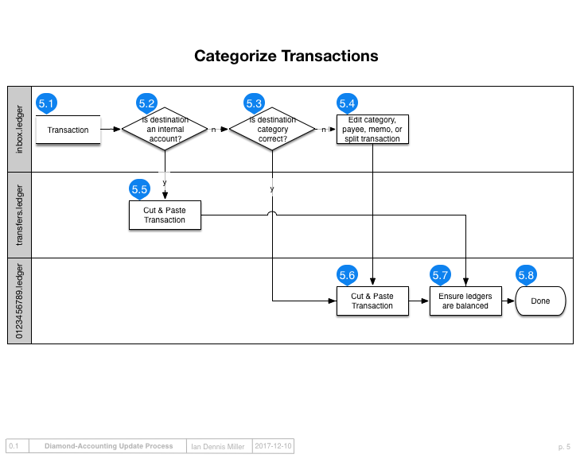

Categorizing
============

Process Inbox
-------------

Once transactions have been synced to `inbox.ledger`, it is time to process the inbox.
The user imports transactions by cut-and-pasting them from the `inbox` into the destination ledger.
The destination ledger is opened in the text editor depending on the account is indicated by the `sync.sh` comments.
When the inbox is empty because all the transactions were pasted, this process is done.

The primary goals for processing the inbox are: 1) ensure the categories of the transactions have been set correctly; and 2) migrate those transactions into the proper ledger.
The category can usually be determined from the memo and the date, which should enable you to remember the transaction or find a receipt that can establish the category.
There is a separate review step called "clearing" in which transactions are more closely examined to figure out if they are accurate or not.

Rules for processing
--------------------

There are a few things to watch for while processing.

- If the transaction is a transfer between your own ledger accounts, then move this transaction to `transfers.ledger`.  Some banks provide a generic memo for transfers between internal accounts, so it may be necessary to investigate transactions online.
- If the category is incorrect, edit the transaction before moving it from `inbox.ledger`.  Changing a category and re-running the import can automatically apply that change to remaining transactions in the inbox.
- To see what categories are available, run `make ui` in order to interactively explore the categories in the ledger.
- If the transaction represents a split transaction, then add lines to the transaction before cut-and-pasting it from `inbox.ledger`.
- If a transaction looks proper, and especially if the booked amount matches a receipt, then the transaction can be immediately marked as "cleared".  Uncleared transactions can be investigated later with a special report, after importing is completed.
- When cut-and-pasting, move one or more transaction from the top of the inbox to the bottom of the account ledger you're importing to.

Next steps
----------

Next read about :doc:`clearing` and balances need to match their counterparts as calculated by the bank.
