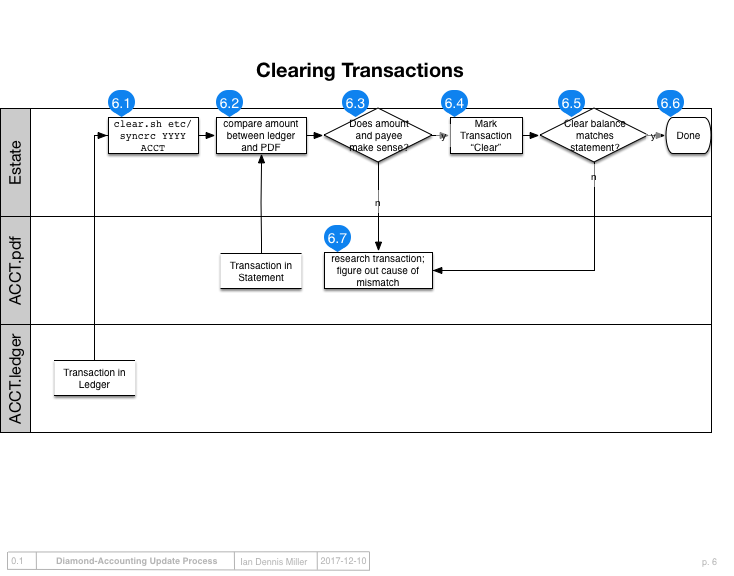

Clearing Transactions
=====================

Importing ensures the categories are roughly correct.
Now we must verify that the dollar amounts have been imported correctly.
Once transactions are imported, they must be reviewed for accuracy once before the "numbers" can be trusted.

The way to review transactions for accuracy is to compare the *cleared* ending balance to a statement from the financial institution.
If the balances match, then all of the transactions have been successfully copied over to your ledger; you can now trust the numbers.
Transactions must be marked as "cleared" one by one as they are compared between the ledger and the bank statements.
This review process is called "clearing transactions."

Each bank statement is like a checkpoint that serves to synchronize our ledger with the bank's ledger.
When we independently verify that our record of the transactions sums to the same balance as the bank's, we are confident that the transaction data were downloaded correctly, entered correctly, and are being reported correctly.

Overview
--------

There are a few principles for clearing transactions.

1. open an account ledger and its corresponding bank statement
2. use ``clear.sh`` to interactively review each uncleared transactions in the account
3. confirm cleared ledger balance matches statement balance

Setup
-----

First ensure you have the following materials in front of you:

- the ledger for the account being cleared, which is in ``/ledgers/YYYY/ACCT.ledger``
- the transfers ledger ``/ledgers/YYYY/transfers.ledger``
- bank statements in ``/statements/``

Clear Transactions
------------------

Interactively clear transactions on the command line.
To clear account ``0123`` in the year 2017, use the following command:

::

    clear.sh etc/syncrc 2017 0123

Ledger supports the ability to mark transactions as cleared by placing an asterisk before the memo.
Cleared transactions can be reported apart from uncleared transactions, enabling reports to be generated with accurate numbers even while the ledgers could contain pending transactions.

To clear a transaction, it must be compared against an official record from the party who intermediated the transaction.
If you instructed your bank to pay for a coffee, and if this coffee purchase transaction correctly appears in your ledger, then look to the bank statement to confirm that the billed for the coffee shows up.
When taking data directly from a bank's exported `QFX` file, it's unlikely that the amounts will differ from the statement.
However, when manually entering certain transactions, such as when booking a payment or receivable before it cleared, there is opportunity for data entry errors.

When you use ``clear.sh`` it relies upon a separate tool called cleartrans-cli.
The ``cleartrans-cli`` tool makes the clearing process operate much more quickly.
Although it is simpler to use ``clear.sh``, you can manually invoke this on the command line:

::

    LEDGER_FILE=~/Work/ledger/ledgers/2017/BANK-0000.ledger cleartrans-cli
    ledger --sort date bal --cleared Assets:Bank:Savings

Open the statement in one window, open `cleartrans-cli` in another window, and rapidly scan the bank statement for each amount that cycles through the clearing interface.

When a ledger transaction does not appear on the bank statement, it is either 1) in the future; or 2) invalid.
Usually, the transaction is in the future and will show up on the following month's statement.
In the case of futue transactions, do not clear those transactions: use the interface to skip to the next transaction with the key 'n'.
Uncleared transactions will remain in the ledger until next month when they can be cleared against an official statement.

Verify Balances
---------------

When ``clear.sh`` is done running, it will display a balance.
This balance should match your statement.
If it does, then congratulations: your ledger is probably accurate!

After an entire bank statement's worth of transactions have been cleared, it is time to compare the bottom line.
Some statements - in particular, credit cards - like to hide the bottom line or confuse it with other sub-totals.
There is only one bottom line that matters - and it **must** match your ledger's bottom line.

You can also manually check the balance of all cleared transactions matches:

::

    ledger --sort date bal --cleared Liabilities:CreditCard

What to do if the balance doesn't match?
^^^^^^^^^^^^^^^^^^^^^^^^^^^^^^^^^^^^^^^^

The most common problem is that a transaction was entered but not cleared.
Look to `transfers.ledger` and the original ledger being cleared.
Calculate the amount you are off by: subtract the bank's balance from the ledger balance.
Often times, this amount is a recognizable quantity that will perfectly match exactly one transaction in the ledger.
In case the difference looks "familiar," search for that amount and manually mark the transaction as cleared.

Transfers can become convoluted because they involve two accounts you control, meaning it is more likely for these transactions to be double-entered.
In that case, the amount of the transfer will be equal to the amount of the difference between the bank statement and the ledger balance.
The transaction was probably not cleared, but in case it was actually not entered at all, then manually enter the transfer now.

Sort transactions
-----------------

The transactions are probably sorted already, so this step may not be necessary.
In case transactions are not sorted, the `sorttrans-cli` tool can be used for the job:

::

    LEDGER_FILE=~/Work/accounting/ledgers/2017/BANK-0000.ledger sorttrans-cli

If transactions need to be sorted regularly, then update the `Makefile` with a target so this can be repeated:

::

    make sort-0000

Next steps
----------

Next read about :doc:`reporting`.
