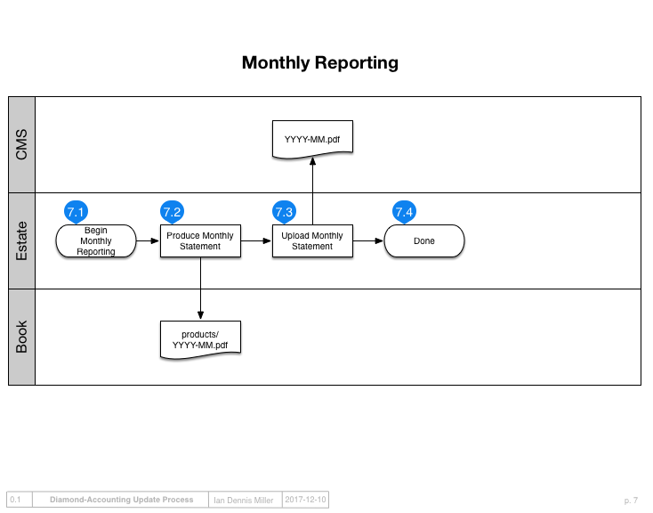

Diagrams
========

Account Initialization
----------------------

Each account must only be initialized once in its lifetime.

Monthly Setup
-------------

This must be performed every month.

Download Transactions and Statements
------------------------------------

Acquire the monthly raw information from the bank.

.. image:: ../_static/diagrams/Downloads.png

Process Transactions
--------------------

Ensure transactions are categorized correctly.
Then, verify amounts against the original bank statements to ensure transactions have "cleared."

.. image:: ../_static/diagrams/Process.png

Categorize Transactions
-----------------------

.. image:: ../_static/diagrams/Categorization.png

Reporting
---------

Generate monthly financial statements and upload them.

