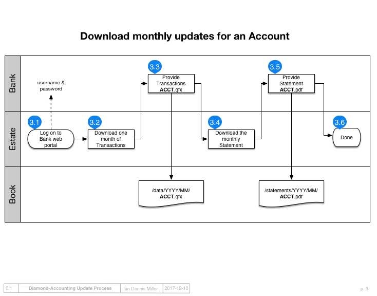

Download Transactions
=====================

The goal of downloading transactions is to download a `.QFX` file for each account containing one month of that account's transactions.
These files will eventually be imported into the ledger with the sync process.

Throughout the download process, accounts are referred to by the last 4 or 5 digits of their account number.
When an account is downloaded, the file will be renamed using the 4 or 5 digit number.

Unique portfolios
-----------------

Each bank or financial institution has a unique process for downloading transactions.
To make this process as repeatable as possible, it is recommended to use account management software to store web URLs and authentication information for logging into your various bank web portals.
Since each accounting portfolio is different, downloading needs to be described in a separate document that will be different for each project.
NB: the Readme.md file in a project scaffold has a starting place for creating this download documentation.

Moving downloads to ledger project
----------------------------------

Once the `.QFX` files have been downloaded and renamed, they must be moved to the ledger project so they can be archived.
Create a folder called `data/YYYY/MM` in the project, where **YYYY** is the year and **MM** is the month.
Move all the downloaded `.QFX` files into this new folder and check it into the repository.

Download Statements
-------------------

Each financial institution produces periodic statements that memorialize your account balances.
These statements need to be downloaded or scanned so they can be compared to the ledger balance, later.
The most convenient time to download these statements is when downloading transaction data.
As with transaction data, the process for downloading statements is unique to each bank.

Downloading is complete
-----------------------

Once the `.QFX` and `.PDF` files are in the repository, the ledger project contains an archive of the bank's record of your account transactions.
These archived `.QFX` and `.PDF` files are unlikely to change and, since they are computer-readable, they are a convenient source of raw transaction data for updating our ledgers.

Next steps
----------

Next read about :doc:`sync`.
