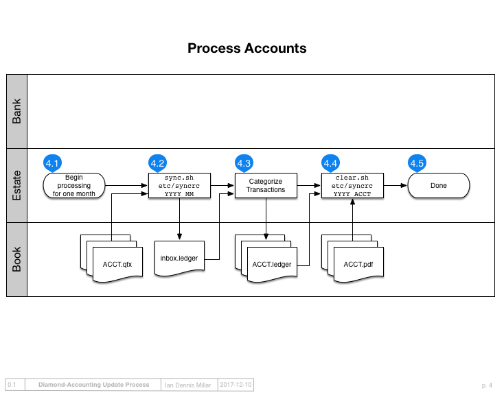

Sync transactions
=================

Sync transactions from the downloaded files in ``/data/`` to Inbox.
This corresponds to **step 4.2** in the diagram.

After downloading, transactions need to be synced to `ledgers/inbox.ledger` according to the configuration specified by [etc/syncrc](../etc/syncrc).
The sync process expects to find `.QFX` files for import in within the ledger project itself, inside the `data/` folder.
To perform the sync, use `bin/sync.sh`, substituting the year and month as appropriate:

::

    bin/sync.sh etc/syncrc YYYY MM

As accounts are synced to the inbox, `sync.sh` adds a comment to the file to provide notice that a new account is being synced.
Watch for these comments during import so you know when to switch ledger files.
The `ofxid` that appears as a comment in each transaction must remain intact for re-running `sync.sh` to be possible.

The configuration file `syncrc`
-------------------------------

The configuration file describes all of the accounts that should be imported by `sync.sh`.
Each row in the configuration is one account and it has three fields:

- financial ID
- 4 or 5-digit account ID
- account name to import into ledger as.

For example:

::

    1 1234 Assets:BankOne:Checking
    1 2345 Assets:BankOne:Savings
    2 3456 Assets:BankTwo:Savings

The financial ID is a number that chosen by you, but it should be unique and consistent within your ledgers.
The account ID and account name should match your portfolio.

Next steps
----------

Next read about :doc:`categorizing`.
